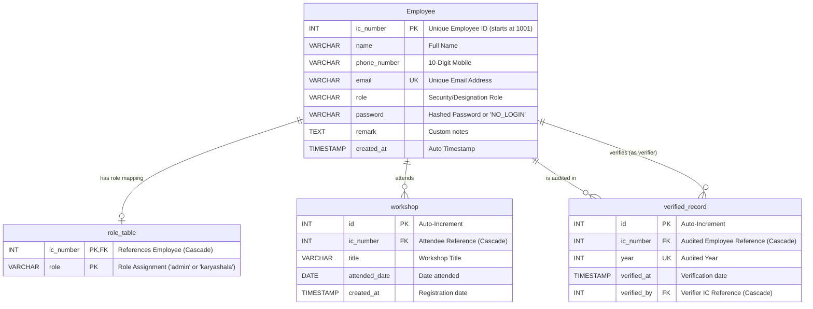
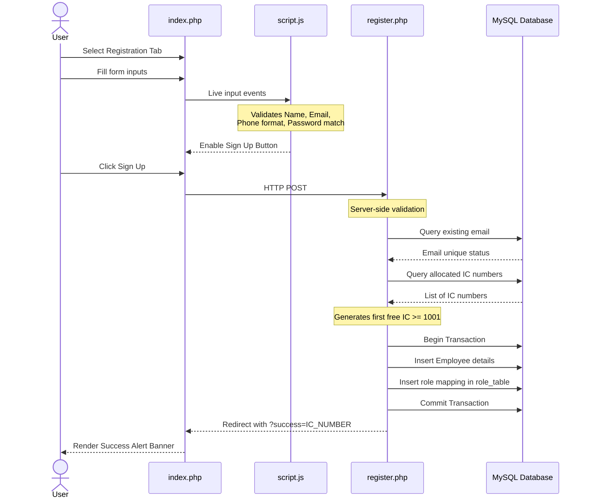
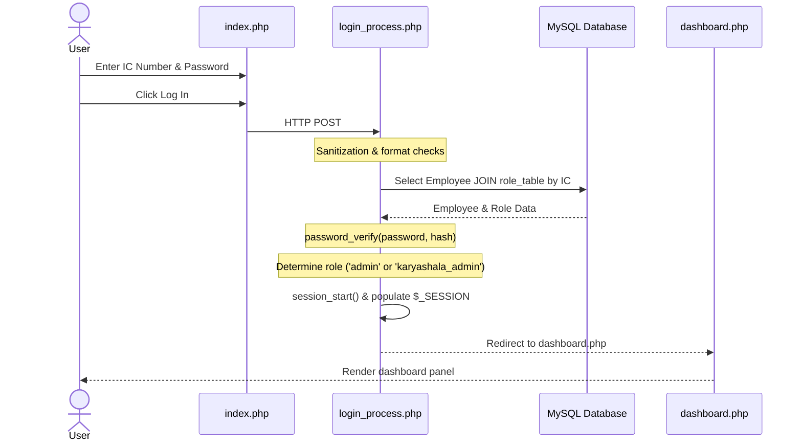
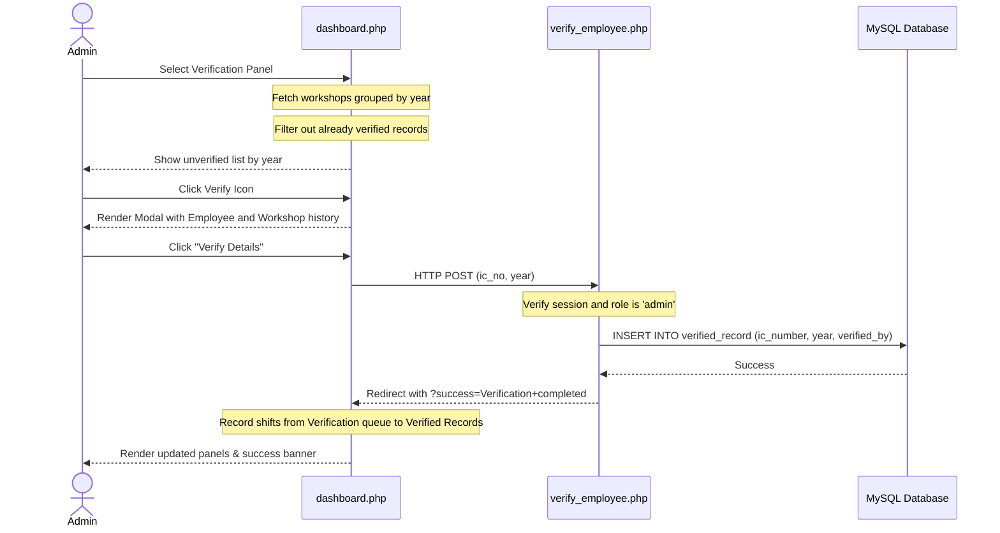

# Karyashala

A workshop attendance management system built with procedural PHP and MySQL, designed for managing employee records, tracking workshop attendances, and performing admin verifications. This document serves as a technical reference for understanding how the application works internally — how the pieces connect, why certain decisions were made, and how data flows through the system.

---

## Table of Contents

1. [Prerequisites](#prerequisites)
2. [Project Structure](#project-structure)
3. [System Design & Architecture](#system-design--architecture)
   - [Architectural Overview](#architectural-overview)
   - [Role-Based Access Control (RBAC)](#role-based-access-control-rbac)
   - [Database Schema & Relationships](#database-schema--relationships)
4. [Database Setup](#database-setup)
   - [Creating the MySQL User](#creating-the-mysql-user)
   - [Running the Schema](#running-the-schema)
   - [Schema Explanation](#schema-explanation)
5. [Project Workflows](#project-workflows)
   - [Registration & Setup Workflow](#registration--setup-workflow)
   - [Authentication (Login) Workflow](#authentication-login-workflow)
   - [Employee Directory Management Workflow](#employee-directory-management-workflow)
   - [Admin Verification & Auditing Workflow](#admin-verification--auditing-workflow)
6. [Transactional Integrity & Safety Guards](#transactional-integrity--safety-guards)
   - [ACID Transactions](#acid-transactions)
   - [Self-Deletion Prevention](#self-deletion-prevention)
   - [Password Security](#password-security)
   - [Prepared Statements & XSS Protection](#prepared-statements--xss-protection)
7. [Session Management](#session-management)
   - [Conditional Session Startup](#conditional-session-startup)
   - [How Alerts Work Without Sessions](#how-alerts-work-without-sessions)
8. [Dashboard Architecture](#dashboard-architecture)
   - [Sidebar Navigation](#sidebar-navigation)
   - [Panel Switching](#panel-switching)
9. [Core Features](#core-features)
   - [View Employees Directory](#view-employees-directory)
   - [Update Employee Info & Workshops](#update-employee-info--workshops)
   - [Add Employee](#add-employee)
   - [Delete Employee](#delete-employee)
10. [Admin Verification System](#admin-verification-system)
    - [Verification Panel](#verification-panel)
    - [Verified Records Audit Log](#verified-records-audit-log)
11. [Logout Process](#logout-process)
12. [Client-Side Validation](#client-side-validation)
13. [Running the Application](#running-the-application)
14. [Stale & Legacy Files](#stale--legacy-files)

---

## Prerequisites

Before running this project, you need the following installed on your machine:

- **PHP 7.4 or later** — with the `mysqli` extension enabled.
- **MySQL 5.7 or later** — any MySQL-compatible server (MariaDB works too).
- A terminal to run commands.

No external PHP libraries, Composer packages, or frameworks are used. The entire application is built with vanilla PHP, plain HTML, CSS, and JavaScript.

---

## Project Structure

```
Karyashala/
├── db.php                     # Database connection (used by every backend file)
├── schema.sql                 # SQL file that creates the database and all tables
├── index.php                  # Login and Sign Up page (the entry point)
├── register.php               # Handles the Sign Up form submission
├── login_process.php          # Handles the Login form submission with password verification
├── dashboard.php              # The main dashboard (renders panels based on roles)
├── add_employee_process.php   # Processes adding a new employee & workshop (Admin/Karyashala Admin)
├── delete_employee.php        # Processes employee record deletion (Admin/Karyashala Admin)
├── update_karyashala_admin.php # Processes employee profile and workshop updates (Admin/Karyashala Admin)
├── verify_employee.php        # Inserts verified record logs for a specific year (Admin only)
├── logout.php                 # Destroys the session and redirects
├── style.css                  # All CSS styles for every page
├── script.js                  # JavaScript for validation, modals, sidebar tabs, and dynamic workshop inputs
├── DRDO-logo.png              # App logo image asset
├── generate_report.php        # Stale/Retired report generation script (Admin only, not linked in UI)
└── README.md                  # This file
```

The application does not use a router or MVC framework. Each `.php` file is either a **page** (renders HTML) or a **processor** (handles form data and redirects). The two main page files are `index.php` and `dashboard.php`. Everything else is a processor — they receive POST data, do their work, and redirect back with a success or error message in the URL.

---

## System Design & Architecture

### Architectural Overview

The application follows a client-server architecture utilizing **Procedural PHP** as the backend engine and a **MySQL** database for persistence. Key features of the architecture include:

- **Stateless Router-less File Routing**: Each PHP file acts as a standalone request handler or page renderer.
- **Hybrid Page/State Loading**: The app uses page redirects for form processing but operates as a **Single Page Application (SPA)** on `dashboard.php` using client-side JavaScript for tab/panel switching to provide a smooth, modern user experience without full page reloads.
- **Cascading Relational Integrity**: Relational tables rely on database-level constraints with cascading deletes on the MySQL level to maintain database cleanliness.

```mermaid
graph TD
    Client[Client Browser] <-->|HTTP POST / GET| WebServer[PHP Development Server]
    WebServer <-->|MySQLi Procedural Queries| Database[(MySQL Database)]
    
    subgraph Client-Side "Vanilla Web Stack"
        Client --> Validation[Form Validation (script.js)]
        Client --> PanelSwitching[SPA Panel Switching (script.js)]
        Client --> Modals[Interactive Modals (script.js)]
    end
    
    subgraph Server-Side "Procedural PHP Handlers"
        WebServer --> Auth[login_process.php / register.php / logout.php]
        WebServer --> Dashboard[dashboard.php]
        WebServer --> Directory[add_employee_process.php / update_karyashala_admin.php / delete_employee.php]
        WebServer --> Verify[verify_employee.php]
    end
```

### Role-Based Access Control (RBAC)

The application enforces a strict role-based capability model. System security levels are categorized into three roles:

| Access Role | Mapped DB Role | Dashboard Privileges | Form Access |
| :--- | :--- | :--- | :--- |
| **System Administrator** | `admin` | View, Update, Add, Delete Employees, Year Verification, Audit Logs | Complete |
| **Karyashala Administrator** | `karyashala_admin` | View, Update, Add, Delete Employees | Restricted (No Verification / Auditing) |
| **Normal Staff** | `NULL` or other | None (Access Denied at Login) | None |

### Database Schema & Relationships

The database is built on four core tables, mapped below with their entity relationships:



---

## Database Setup

### Creating the MySQL User

The application connects to MySQL using the credentials defined in `db.php`:

```
Host:     127.0.0.1
User:     library_user
Password: library_pass123
Database: karyashala
```

Before running the schema, you need to create this user. Open a MySQL terminal as root:

```bash
mysql -u root -p
```

Then run these commands inside the MySQL shell:

```sql
CREATE USER 'library_user'@'localhost' IDENTIFIED BY 'library_pass123';
GRANT ALL PRIVILEGES ON karyashala.* TO 'library_user'@'localhost';
FLUSH PRIVILEGES;
```

This creates the user and gives it privileges over the `karyashala` database.

### Running the Schema

Once the user exists, you can execute the schema file directly from your terminal:

```bash
mysql -u library_user -p library_pass123 < schema.sql
```

Or if you are already inside the MySQL shell:

```sql
SOURCE /full/path/to/Karyashala/schema.sql;
```

This sets up the `karyashala` database tables and references.

---

### Schema Explanation

The database consists of four tables designed to unify employee data and maintain clean, normalized relational tables:

#### 1. `Employee`
Unified table storing all employees in the system, including super administrators, directory managers (karyashala admins), and normal staff.

| Column | Type | Notes |
| :--- | :--- | :--- |
| `ic_number` | INT | Primary key. Unique Employee ID. |
| `name` | VARCHAR(100) | Full name of the employee. |
| `phone_number`| VARCHAR(20) | 10-digit mobile number. |
| `email` | VARCHAR(100) | Unique email address. |
| `role` | VARCHAR(20) | Designation role (e.g. `'admin'`, `'karyashala_admin'`, or NULL/empty space for normal staff). |
| `password` | VARCHAR(255) | Hashed password string (set to `'NO_LOGIN'` for dashboard-added directory entries). |
| `remark` | TEXT | Optional custom notes or remarks. |
| `created_at` | TIMESTAMP | Auto-filled when inserted. |

#### 2. `role_table`
Maps employees to system dashboard roles, controlling login and panel authorization.

| Column | Type | Notes |
| :--- | :--- | :--- |
| `ic_number` | INT | Primary key component & Foreign key → `Employee.ic_number` (Cascade delete). |
| `role` | VARCHAR(20) | Primary key component. Security role: `'admin'` or `'karyashala'`. |

#### 3. `workshop`
Stores details of workshops attended by employees. This table is strictly normalized, referencing `Employee` to fetch employee info dynamically during runtime.

| Column | Type | Notes |
| :--- | :--- | :--- |
| `id` | INT | Auto-incrementing primary key. |
| `ic_number` | INT | Foreign key → `Employee.ic_number` (Cascade delete). |
| `title` | VARCHAR(255) | Title/Name of the attended workshop. |
| `attended_date`| DATE | Date of workshop attendance. |
| `created_at` | TIMESTAMP | Auto-filled when inserted. |

#### 4. `verified_record`
Logs verified attendance audits conducted by system administrators.

| Column | Type | Notes |
| :--- | :--- | :--- |
| `id` | INT | Auto-incrementing primary key. |
| `ic_number` | INT | Foreign key → `Employee.ic_number` (Cascade delete). |
| `year` | INT | Year of workshop attendance being audited. |
| `verified_at`| TIMESTAMP | Auto-filled when verified. |
| `verified_by`| INT | Foreign key → `Employee.ic_number` (The Admin IC that approved). |

---

## Project Workflows

The application coordinates data changes through specific client-server workflows, detailed below:

### Registration & Setup Workflow

When a visitor registers an administrative account on the public sign-up page:

1. **Client-side Verification**: `script.js` validates parameters in real-time.
2. **Server-side Validation**: Handled by `register.php`. Ensures no field is left blank, formats match, and that the email is unique in the `Employee` table.
3. **IC Number Allocation**: Query checks existing records to find the first unused integer starting from `1001` to use as the employee's `ic_number`.
4. **Transactional Write**: Inserts the hashed password and user profile into `Employee`, and writes the corresponding designation mapping to `role_table` in a safe database transaction.
5. **Completion Alert**: The user is redirected to `index.php` showing their newly generated unique login ID.



### Authentication (Login) Workflow

For existing administrators logging in:

1. **Submit**: Credential fields (IC Number and Password) are posted to `login_process.php`.
2. **Database Lookup**: Selects the user from `Employee` joined on `role_table` using the provided IC Number.
3. **Password Verification**: Validates the plaintext password against the database hash using `password_verify()`.
4. **Privilege Mapping**: If authentication succeeds and the user has a valid administrative role mapped, the session is created. If no role is mapped (normal staff), access is denied.
5. **Session Initiation**: Session variables (`user_ic`, `user_name`, `user_designation`, `user_email`, `user_phone`) are instantiated, and the user is redirected to `dashboard.php`.



### Employee Directory Management Workflow

Authenticated managers (both Admin and Karyashala Admin) handle employee registrations and updates through the dashboard directory:

- **Add Employee**: Registers staff details and their first attended workshop. A database transaction ensures `Employee`, `role_table`, and `workshop` records are inserted atomically. The account password is set to `'NO_LOGIN'` so they cannot log in.
- **Update Details**: Dynamic tabs inside the update modal let the manager update personal information and edit or add workshops. Dynamic inputs allow adding multiple workshops concurrently. Changes are submitted to `update_karyashala_admin.php` and applied atomically inside a transaction.
- **Delete Record**: Deleting an employee removes their `Employee` record. Foreign keys with `ON DELETE CASCADE` automatically clean up all associated `role_table` mappings, `workshop` entries, and `verified_record` logs. The logged-in admin is prevented from deleting their own account via a session check.

### Admin Verification & Auditing Workflow

Auditing and verification are restricted to the **System Administrator** (`admin` role):

1. **Grouping**: The dashboard pulls workshops and groups them by year and employee.
2. **Filtering**: Already verified records (matching a record in `verified_record` for that year and employee) are filtered out of the verification queue.
3. **Admin Verification**: The admin selects an unverified employee's list of workshops, reviews them, and clicks "Verify Details".
4. **Execution**: The verification request posts to `verify_employee.php`. It writes a new entry to `verified_record` including the Admin's IC Number (verifier) and the verified year.
5. **Auditing**: The verified entry disappears from the Verification list and shows up in the historical **Verified Records** audit log page.



---

## Transactional Integrity & Safety Guards

### ACID Transactions

The system uses standard ACID database transactions (`mysqli_begin_transaction($conn)`) for multi-step directory insertions and edits:

- When adding a new employee, inserting data into `Employee`, mapping their role in `role_table`, and inserting their first workshop in `workshop` must succeed together. If any insert fails (e.g. database error, duplicate unique key, or invalid date), the transaction is rolled back via `mysqli_rollback($conn)`, preventing orphan records.
- When updating an employee, personal info changes, workshop updates, and new workshop additions are grouped into a transaction block to maintain database consistency.

### Self-Deletion Prevention

To prevent administrators from locking themselves out of the system, `delete_employee.php` checks the target ID against the active session `$_SESSION['user_ic']`. If they match, the request is rejected with a safety warning banner.

### Password Security

- **Hashing**: Public registrations hash user passwords using `password_hash($password, PASSWORD_DEFAULT)`, storing them securely.
- **NO_LOGIN Restrictions**: Employees added by managers via the dashboard do not require a login. Their password string is initialized to `'NO_LOGIN'`, which is unmatchable by `password_verify()`. This prevents unauthorized access to the system dashboard while keeping database column constraints intact.

### Prepared Statements & XSS Protection

- **SQL Injection Prevention**: All queries that accept user inputs use parameterized prepared statements (`mysqli_prepare`, `mysqli_stmt_bind_param`, and `mysqli_stmt_execute`). No direct input concatenation is allowed.
- **XSS Prevention**: User inputs rendered in PHP templates are sanitised using `htmlspecialchars()`. Dynamic client side elements are rendered safely via text node assignments or escaped values.

---

## Session Management

### Conditional Session Startup

Pages requiring session access implement a conditional check before loading session files, minimizing disk read overhead for guests or bots:

```php
if (isset($_COOKIE[session_name()])) {
    session_start();
}
```

This pattern is active across `index.php`, `dashboard.php`, `add_employee_process.php`, `delete_employee.php`, `update_karyashala_admin.php`, and `verify_employee.php`.

### How Alerts Work Without Sessions

Error and success alerts are passed via URL query parameters (e.g., `?success=...` or `?error=...`). The destination page reads these parameters and displays visual banners. This keeps the application stateless prior to authentication.

---

## Dashboard Architecture

`dashboard.php` acts as the single page application interface for authenticated users.

### Sidebar Navigation

The sidebar layout adapts depending on the logged-in user's role:

- **Employees (Visible to both Admin and Karyashala Admin)**:
  - **Home**: Profile details card.
  - **View Employees**: Directory list with workshop timelines.
  - **Update Info**: Directory list with edit access.
  - **Add Employee**: Registration form for new employee profiles.
- **Admin (Visible to Admin only)**:
  - **Verification**: Workspaces grouped by year needing verification.
  - **Verified Records**: Audit logs of verified items.
- **Logout**: Triggers session teardown.

### Panel Switching

Content panels are defined in HTML as `<section>` elements with the class `content-panel`. Only one panel is visible at a time (`active` class). 

The initial active panel is determined on the server using the `panel` query parameter, defaulting to `home`. Once loaded, sidebar links trigger client-side switching via the `showPanel(name)` JavaScript function, avoiding page reloads.

---

## Core Features

### View Employees Directory

Displays a table of all employees registered in the `Employee` table. Clicking the eye icon opens a details modal showing employee information, remarks, and a chronological vertical timeline of their attended workshops (joined dynamically from the `workshop` table).

### Update Employee Info & Workshops

Provides an update modal with two tabs:
1. **Personal Details**: Modify name, custom designation, phone, email, and remarks in `Employee`.
2. **Workshops**: Edit existing workshop titles/dates or dynamically append new workshops to the history list in `workshop`.

Submissions are handled by `update_karyashala_admin.php` inside a database transaction to ensure update integrity across `Employee`, `role_table`, and `workshop`.

### Add Employee

Allows directory managers to add new employees directly. Requires profile details (name, designation, phone, email, remark) and their initial workshop (title and date).
`add_employee_process.php` handles this inside a transaction, writing the employee profile to `Employee`, role configuration to `role_table` (if applicable), and the workshop to `workshop` simultaneously. The generated account is initialized with `NO_LOGIN` as its password hash to restrict login access.

### Delete Employee

Allows deleting an employee from `Employee`. Self-deletion is blocked using an active session check in `delete_employee.php`. Deleting an employee cascades to automatically remove all associated workshops, role mappings, and verification records.

---

## Admin Verification System

### Verification Panel

Displays workshops grouped by year. The page lists employees who attended workshops in that year. Clicking the verify icon opens a modal displaying employee details and their workshop history for the selected year. Clicking "Verify Details" submits to `verify_employee.php`, logging a new entry in `verified_record`.

### Verified Records Audit Log

Displays a historical log of all verified employee records grouped by year, detailing the timestamp of verification, the verifier, and the specific workshops attended during that year.

---

## Logout Process

`logout.php` executes a complete teardown of session states:

1. Resumes active session with `session_start()`.
2. Clears session array variables (`$_SESSION = []`).
3. Sets the browser session cookie to expire in the past.
4. Destroys the server session session file (`session_destroy()`).
5. Redirects to `index.php?logout=1`.

---

## Client-Side Validation

Forms implement live client-side validation in `script.js` to assist the user. The submit button is disabled until all inputs satisfy constraints:

| Input Field | Rule | Feedback |
| :--- | :--- | :--- |
| **Name** | Cannot contain digits | Red border + warning |
| **Phone** | Exactly 10 digits | Red border + warning |
| **Email** | Matches standard email regex | Red border + warning |
| **Password** | Minimum 6 characters | Red border + warning |
| **Confirm Password** | Matches Password | Red border + warning |
| **IC Number (Login)** | Numeric digits only | Red border + warning |

---

## Running the Application

1. Make sure your local MySQL server is active and the database is configured.
2. Navigate to the project folder and start the PHP development server:

```bash
cd Karyashala
php -S localhost:8000
```

3. Open `http://localhost:8000` in your web browser.
4. Log in using an existing IC number and password, or register a new administrator/karyashala administrator account.

---

## Stale & Legacy Files

The repository contains `generate_report.php`, which is a legacy script from a previous version of the codebase. It relies on deprecated tables (`karyashala_admin`, `workshops`, and `reports`) that are no longer part of the unified database schema (`schema.sql`). It is retained for archival purposes but is not integrated or linked anywhere in the current user interface.
